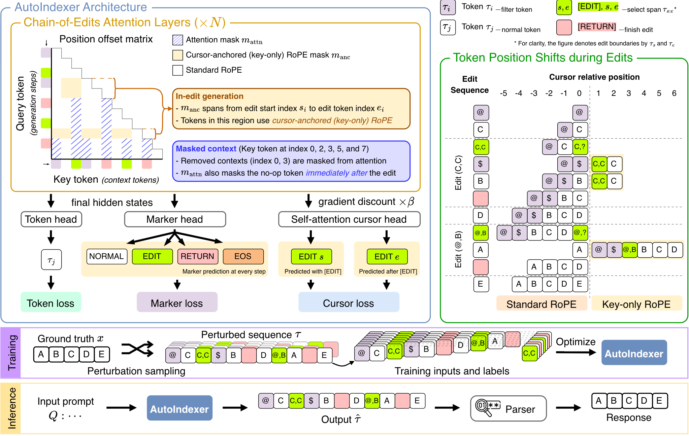
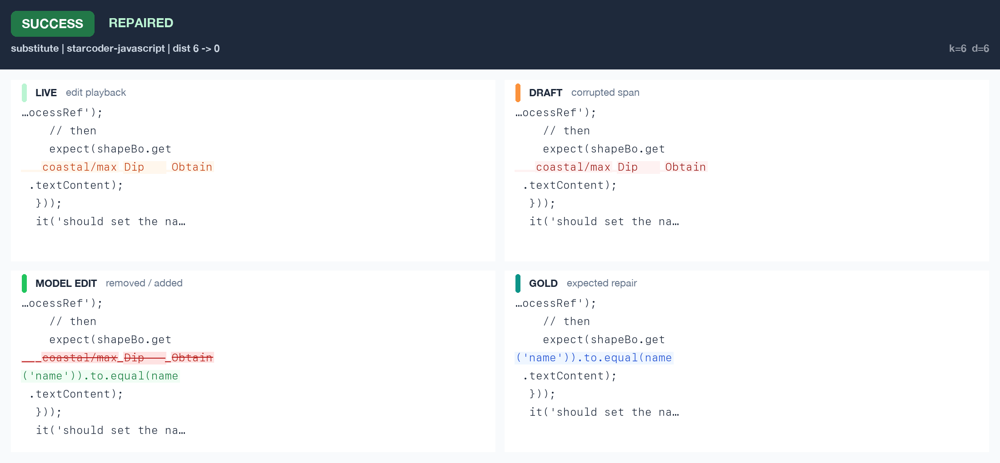

# AutoIndexer

**AutoIndexer: Flexible-Order Decoding by Training Causal Models on Chains of Edits**

[](https://autodeskailab.github.io/autoindexer-demo/)
[](https://openreview.net/pdf?id=QxsLMneprg)
[](https://huggingface.co/collections/ADSKAILab/autoindexer)

If you find this repository helpful, please cite our [NeurIPS 2026 Workshop paper](https://openreview.net/pdf?id=QxsLMneprg):

```bibtex
@inproceedings{
ishida2026autoindexer,
title={AutoIndexer: Flexible-Order Decoding by Training Causal Models on Chains of Edits},
author={Shu Ishida and Aliasghar Khani and Tianyu Zhang and The Cong Luong and James Seale Smith and Adam Gaier},
booktitle={NeurIPS Workshop on Beyond Next Token Prediction},
year={2026},
url={https://openreview.net/forum?id=QxsLMneprg}
}
```

### Overview of AutoIndexer

**AutoIndexer** trains causal language models on chains of edits so they can revise prior outputs in hindsight via insertions, substitutions, and deletions. The model predicts marker tokens that open and close edits and moves a cursor to start and end positions in the existing sequence, analogous to a text editor. 



#### Example of a successful context edit by AutoIndexer



Visit our [project page](https://autodeskailab.github.io/autoindexer-demo/) for more qualitative examples of AutoIndexer's self-edits.

---

This repository provides [Hydra](https://hydra.cc/docs/intro/) configuration, [`transformers.Trainer`](https://huggingface.co/docs/transformers/en/main_classes/trainer) training, and [Accelerate](https://huggingface.co/docs/accelerate/index) scaling for continued pretraining and instruction tuning on Qwen3.

## Installation

Create a `conda` / `venv` environment, and in there, run
```
# pip install -e .
pip install -e .[gpu]   # if you are in a GPU enabled environment
pre-commit install       # for code formatting, if you are contributing to the repo
```

## Training AutoIndexer

AutoIndexer training happens in two stages, each with its own config family and its own dataset mix:

- **CPT** (continued pretraining) -- `configs/cpt_datamix/` -- trains the chain-of-edits objective on top of a pretrained **base** model (`Qwen/Qwen3-8B-Base`), on a streamed mix of DCLM, FineWeb-Edu, SlimPajama, StarCoderData, and OpenWebMath (see `configs/cpt_datamix/_datamix.yaml`).
- **SFT** (instruction tuning) -- `configs/instruct_sft_mix/` -- instruction-tunes the chain-of-edits objective on top of the **instruct** model (`Qwen/Qwen3-8B`), on an Alpaca/Dolly/WizardLM/UltraChat + CodeAlpaca/Evol-Instruct-Code/Magicoder/Glaive-Code-Assistant mix (see `configs/instruct_sft_mix/_datamix.yaml`).

Each family ships an `autoindexer_8B.yaml` (full fine-tune) and an `autoindexer_8B_lora_p5.yaml` (LoRA, sized for multi-GPU nodes) config.

> **NOTE**
> These configs default `model.model_config.attn_implementation` to the custom `autoindexer_cutedsl` kernel, which currently only supports Hopper (e.g. H100) and Blackwell (e.g. B200) GPUs -- a Flash Attention 4 bug prevents it from supporting Ampere (e.g. A10/A100). If the CuTeDSL kernel is not available, the code will fall back to using `model.model_config.attn_implementation=autoindexer_triton`.

### CPT
Continual pre-training is done on an interleaved mix of DCLM, FineWeb-Edu, SlimPajama, StarCoderData, and OpenWebMath -- see the `data.sources` comment in `configs/cpt_datamix/_datamix.yaml` for the mix rationale and how to retune it.

```bash
# Single process
python main.py train -f configs/cpt_datamix/autoindexer_8B.yaml

# Local, multi-GPU (e.g. 4 GPUs with ZeRO-2 + CPU offload)
accelerate launch --config_file configs/accelerate/zero2.yaml --num_processes 4 \
    main.py train -f configs/cpt_datamix/autoindexer_8B.yaml

# LoRA variant
accelerate launch --config_file configs/accelerate/zero2.yaml --num_processes 4 \
    main.py train -f configs/cpt_datamix/autoindexer_8B_lora_p5.yaml
```

At the scale `configs/cpt_datamix` is streamed at, reading straight from the HF Hub is prone to stalls that can hang an entire distributed run -- see [Mirroring pretraining data to S3](#mirroring-pretraining-data-to-s3) before a large CPT run.

### SFT

Instruction tuning is done on an interleaved mix of Alpaca, Dolly, WizardLM, UltraChat, CodeAlpaca, Evol-Instruct-Code, Magicoder, and Glaive-Code-Assistant -- see the `data.sources` comment in `configs/instruct_sft_mix/_datamix.yaml` for the mix rationale and how to retune it.

```bash
# Single process
python main.py train -f configs/instruct_sft_mix/autoindexer_8B.yaml

# Local, multi-GPU
accelerate launch --config_file configs/accelerate/zero2.yaml --num_processes 4 \
    main.py train -f configs/instruct_sft_mix/autoindexer_8B.yaml

# LoRA variant
accelerate launch --config_file configs/accelerate/zero2.yaml --num_processes 4 \
    main.py train -f configs/instruct_sft_mix/autoindexer_8B_lora_p5.yaml
```

The `instruct_sft_mix` sources are small enough (tens to hundreds of thousands of rows) to stream directly from the Hub -- no S3 mirroring step is needed here.

Both families also ship plain (non-AutoIndexer) baseline configs for the same models and data mixes -- `qwen3_4B.yaml`, `qwen3_8B.yaml`, `qwen3_8B_p5.yaml`, `qwen3_8B_lora_p5.yaml` -- useful for comparing against an un-modified Qwen3 fine-tune on the same data.

### Mirroring pretraining data to S3

`load_dataset_mix` (used by the `configs/cpt_datamix/` data mix) streams its sources live from the HF Hub by default. At the scale that mix is streamed at, this is prone to read timeouts/retries against huggingface.co -- and since NCCL/DeepSpeed collectives have no default timeout, a single rank stalled on one of these can hang the entire distributed training run rather than just that rank. A source can opt into reading a pre-mirrored copy from local disk instead by setting `local_dir` (see `configs/cpt_datamix/_datamix.yaml`) and pointing `data.local_data_dir` at the directory that contains those mirrors (for example `++data.local_data_dir=/data/cpt_datamix` after syncing from S3 with `aws s3 sync`).

To populate the mirror, use `scripts/mirror_hf_dataset_to_s3.py`. Rather than mirroring a source's entire (often TB-scale) corpus, it caps each source to roughly the number of rows a run will actually consume: it reads each parquet shard's row count from its footer metadata (a small HTTP range read, not a download of the file) and only downloads as many shards as needed to cover the budget.

Mirror the whole `_datamix.yaml` mix for a run needing (say) 1,000,000 training samples:
```bash
python scripts/mirror_hf_dataset_to_s3.py --all \
    --datamix-config configs/cpt_datamix/_datamix.yaml \
    --total-samples 1_000_000 \
    --s3-uri s3://<your-bucket>/cpt_datamix
```
Each source's mirror is sized to its share of `--total-samples`, by its mixing `weight` -- the same normalization `load_dataset_mix` itself uses -- padded by `--margin` (default `1.2`, since interleaving is probabilistic, not exact). Use the actual run's `trainer.num_train_samples` for `--total-samples` (e.g. as overridden in `configs/cpt_datamix/qwen3_8B_p5.yaml`), not necessarily `_datamix.yaml`'s own default, since this script only reads whatever config path you pass it.

Or mirror a single source directly, e.g. to raise just one language's row budget:
```bash
python scripts/mirror_hf_dataset_to_s3.py \
    --dataset-name bigcode/starcoderdata --data-dir python \
    --local-dir starcoderdata/python --min-rows 2_000_000 \
    --s3-uri s3://<your-bucket>/cpt_datamix
```

Both forms are incremental/safe to re-run (e.g. to raise the budget later, or pick up a dataset update). After syncing mirrors to local disk, pass `++data.local_data_dir=<path>` when launching training. Sources without a `local_dir` keep streaming from the Hub regardless.


## Usage

Basic training with default settings:
```bash
python main.py train -f <config path> 
```

> **NOTE**
> `autoindexer_cutedsl` kernel may fail for multiple GPUs under this setting. Either switch to the `autoindexer_triton` implementation or use `accelerate launch` for multi-GPU training.

Overriding training configuration with custom model and dataset:
```bash
accelerate launch --config_file configs/accelerate/zero2.yaml --num_processes 4 \
    main.py train -f <config path> \
    model.pretrained_model_name_or_path=<model path> \
    trainer.per_device_train_batch_size=2 \ 
    ++trainer.learning_rate=2e-4
```

Configs are composed with [Hydra](https://hydra.cc/docs/intro/). Override any field from the command line with dotted `key=value` arguments (prefix with `++` when adding or forcing a key that the YAML does not set).

## Logs and Checkpoints

- Training logs are saved in `./logs/<mode>/<experiment_name>/`
- Model checkpoints are saved in `./logs/<mode>/<experiment_name>/checkpoints/`
- Results are also logged in Comet to your workspace defined in the `COMET_WORKSPACE` env variable.
- View training progress with TensorBoard:
  ```bash
  tensorboard --logdir ./logs/
  ```
